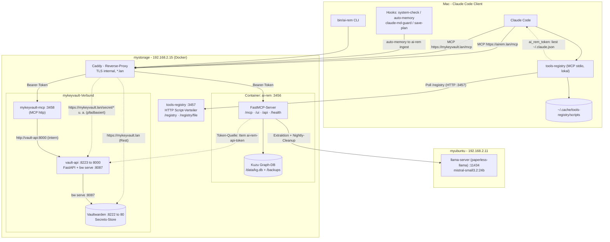

# Architektur: ai-rem · mykeyvault · tools-registry

Drei zusammengehörige MCP-Systeme für den Claude-Code-Betrieb im LAN:

- **ai-rem** — persistentes Langzeit-Gedächtnis (Knowledge Graph) als FastMCP-Server mit eingebetteter Kuzu-DB.
- **mykeyvault** — Secrets-Verbund: Vaultwarden als Store, `vault-api` als Token-authentifiziertes REST-Gateway, `mykeyvault-mcp` als MCP-Frontend.
- **tools-registry** — lokaler MCP-Server, der Scripts als Tools registriert und sie live von einem zentralen HTTP-`tools-registry` bezieht.

Sie spielen so zusammen: Alle HTTP-MCP-Kanäle laufen über **Caddy** (TLS internal, `*.lan`) auf **mystorage**; authentifiziert wird mit **einem gemeinsamen Bearer-Token** (`ai-rem-api-token`), das ursprünglich aus Vaultwarden stammt und über `vault-api` verteilt wird. **llama-server** läuft separat auf **myubuntu** (GPU, Container `paperless-llama`, geteilt mit paperless-ai) und liefert ai-rem die Transcript-Extraktion und die nächtlichen Cleanup-Urteile. **tools-registry** läuft als stdio-Prozess lokal auf dem Mac und synchronisiert seine Scripts per HTTP vom `tools-registry`.

## Komponenten

| Komponente | Host | Port | Protokoll / Zugang | Zweck |
|---|---|---|---|---|
| ai-rem | mystorage | 3456 | HTTP-MCP via `https://airem.lan/mcp` (Caddy), Bearer | Knowledge-Graph-Gedächtnis (FastMCP + Kuzu), Web-UI, Backup/Cleanup |
| Kuzu Graph-DB | mystorage | — | eingebettet in ai-rem | Entities/Relations (`/data/kg.db`), Backups (`/backups`) |
| mykeyvault-mcp | mystorage | 3458 | HTTP-MCP via `https://mykeyvault.lan/mcp` (Caddy, pfadbasiert), Bearer | MCP-Frontend für die Vault-Tools (kein Secret-Leak in den Kontext) |
| vault-api | mystorage | 8223→8000 | REST via `https://mykeyvault.lan` (Caddy, pfadbasiert: `/secret/*`, `/items*`, `/item/*`, `/ssh-key/*`, `/ssh-keys`, `/health`), Bearer | Token-Gateway um die Bitwarden-CLI; hält `bw serve` (`:8087`) entsperrt |
| Vaultwarden | mystorage | 8222→80 | `https://mykeyvault.lan` (Caddy, alle übrigen Pfade) | Eigentlicher Secrets-Store |
| tools-registry | mystorage | 3457 | reines HTTP (LAN-only, keine Auth) | Verteilt die Scripts (`/registry`, `/registry/file`) |
| tools-registry | Mac (lokal) | — | MCP stdio (Node-Prozess) | Registriert Scripts als Tools; pollt den Registry alle 5 s |
| llama-server | myubuntu | 11434 | HTTP (OpenAI-kompatibel) | Transcript-Extraktion + Nightly-Cleanup-Urteile für ai-rem (Container `paperless-llama`, geteilt mit paperless-ai) |
| Caddy | mystorage | — | Reverse-Proxy, `tls internal` | Terminiert TLS für alle `*.lan`-Endpunkte |

**Auth:** ai-rem und mykeyvault-mcp teilen sich denselben Bearer-Token (`ai-rem-api-token`, als `MCP_AUTH_TOKEN`); `vault-api` verwendet ihn als `VAULT_API_TOKEN`. Der Token stammt aus Vaultwarden und wird über `vault-api` an die Clients verteilt; ai-rem frischt ihn pro Session im Hintergrund auf.

> **Hinweis:** `mykeyvault-mcp` läuft produktiv als HTTP-MCP-Container (`:3458`, `https://mykeyvault.lan/mcp`). Der Repo-Code (`mcp/src/index.ts`) zeigt noch die ältere stdio-Variante — das Repo hängt hier hinter der Produktion. Dieses Diagramm bildet die deployte Realität ab.
>
> **Hostnamen-Konvention (seit 2026-06-11):** Alles, was zu mykeyvault gehört, läuft unter dem einen Hostnamen `mykeyvault.lan` mit pfadbasiertem Caddy-Routing (`/mcp*` → mykeyvault-mcp, vault-api-Pfade → vault-api, Rest → Vaultwarden). Die früheren Spezial-Hostnamen `keyvault-mcp.lan` und `keyvault-api.lan` sind abgeschafft.
